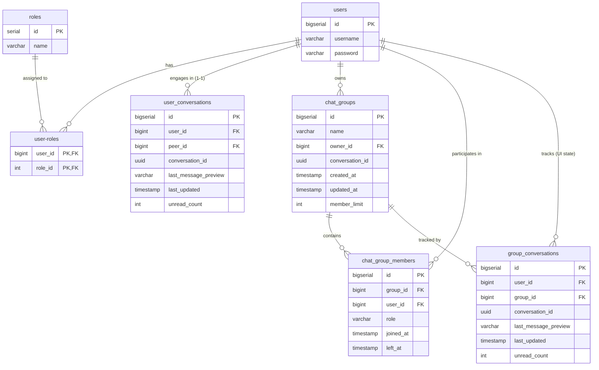

# Kiến trúc Dữ liệu (Data Architecture) - Chat App

Tài liệu này mô tả cấu trúc dữ liệu của dự án Chat App, bao gồm các quyết định thiết kế theo hướng **Polyglot Persistence** (sử dụng đa cơ sở dữ liệu để tối ưu cho từng loại workload).

## Tổng quan Chiến lược (Polyglot Persistence Strategy)
Hệ thống sử dụng hai loại cơ sở dữ liệu chính:
1. **PostgreSQL**: Cơ sở dữ liệu quan hệ (RDBMS) dùng để lưu trữ các dữ liệu có cấu trúc chặt chẽ, ít thay đổi và yêu cầu tính toàn vẹn cao (ACID) như thông tin người dùng, phân quyền, nhóm chat và danh sách các cuộc hội thoại.
2. **Apache Cassandra**: Cơ sở dữ liệu NoSQL (Wide-column store) tối ưu cho việc ghi dữ liệu liên tục (Write-heavy) và truy vấn dữ liệu theo chuỗi thời gian (Time-series data). Được sử dụng chuyên biệt để lưu trữ nội dung tin nhắn.

---

## 1. Cơ sở dữ liệu Quan hệ (PostgreSQL)

Quá trình khởi tạo và thay đổi lược đồ được quản lý bởi **Flyway** (thư mục `src/main/resources/db/migration`).

### 1.1 Sơ đồ Thực thể - Liên kết (ERD)



### 1.2 Chi tiết các bảng (Tables)

#### Bảng `users`
Lưu trữ thông tin tài khoản người dùng đăng nhập.
- `id` (BIGSERIAL, PK)
- `username` (VARCHAR, UNIQUE): Tên đăng nhập.
- `password` (VARCHAR): Mật khẩu (đã được hash).

#### Bảng `roles` & `user-roles`
Quản lý phân quyền (Authorization) của người dùng (ví dụ: ADMIN, USER).
- `roles.name` (VARCHAR, UNIQUE)
- `user-roles`: Bảng trung gian n-n nối giữa `users` và `roles`.

#### Bảng `user_conversations`
Lưu trữ trạng thái danh sách chat 1-1 hiển thị trên giao diện của từng người dùng.
- `id` (BIGSERIAL, PK)
- `user_id` (BIGINT, FK): Người sở hữu bản ghi inbox này.
- `peer_id` (BIGINT, FK): Người đang chat cùng.
- `conversation_id` (UUID): ID chung của cuộc hội thoại để liên kết sang Cassandra.
- `last_message_preview` (VARCHAR): Trích xuất nội dung tin nhắn cuối để hiển thị ở Sidebar.
- `last_updated` (TIMESTAMP): Thời gian có tin mới nhất để sắp xếp (Sort).
- `unread_count` (INT): Số tin nhắn chưa đọc.
- *Index*: `idx_user_last_updated` để tối ưu query danh sách chat.

#### Bảng `chat_groups`
Lưu trữ thông tin cấu hình của một nhóm chat.
- `id` (BIGSERIAL, PK)
- `name` (VARCHAR): Tên nhóm.
- `owner_id` (BIGINT, FK): Trưởng nhóm/người tạo.
- `conversation_id` (UUID, UNIQUE): ID chung để lấy tin nhắn nhóm.
- `member_limit` (INT): Giới hạn số lượng thành viên (Mặc định 100).

#### Bảng `chat_group_members`
Lưu trữ danh sách thành viên của nhóm chat.
- `group_id` (BIGINT, FK)
- `user_id` (BIGINT, FK)
- `role` (VARCHAR): Vai trò trong nhóm (MEMBER, ADMIN).
- `joined_at` (TIMESTAMP)
- `left_at` (TIMESTAMP): Đánh dấu thời điểm rời nhóm (Soft delete).
- *Index*: `idx_group_members_group_active`, `idx_group_members_user_active`.

#### Bảng `group_conversations`
Tương tự như `user_conversations`, lưu trữ trạng thái hiển thị của nhóm chat trên giao diện người dùng.
- `user_id` (BIGINT, FK)
- `group_id` (BIGINT, FK)
- `last_message_preview`, `last_updated`, `unread_count`.

> **Ghi chú (Migration V4 & V5)**: Các bảng `group_message_reads` và `group_inbox` từng được khởi tạo ở V3 nhưng đã được **DROP** ở V4, V5 nhằm tối ưu hóa kiến trúc, chuyển đổi việc quản lý message thuần túy sang Cassandra.

---

## 2. Cơ sở dữ liệu Chuỗi thời gian (Apache Cassandra)

Kiến trúc dữ liệu trong Cassandra được thiết kế theo hướng **Query-driven Data Modeling** (Thiết kế dựa trên câu truy vấn). Do Cassandra không hỗ trợ JOIN nên dữ liệu phải được chuẩn bị sẵn theo cấu trúc phù hợp nhất cho lúc đọc.

### 2.1 Bảng `messages` (Chat 1-1)
Lưu trữ toàn bộ tin nhắn của các cuộc hội thoại 1-1.

```cql
CREATE TABLE IF NOT EXISTS messages (
    conversation_id UUID,
    message_id TIMEUUID,
    sender_id BIGINT,
    content TEXT,
    message_type INT,
    created_at TIMESTAMP,
    delivery_status INT,
    PRIMARY KEY ((conversation_id), message_id)
) WITH CLUSTERING ORDER BY (message_id DESC);
```
- **Partition Key (`conversation_id`)**: Đảm bảo tất cả tin nhắn của cùng một cuộc trò chuyện sẽ được lưu trữ trên cùng một Node trong cụm Cassandra.
- **Clustering Key (`message_id DESC`)**: Tin nhắn được tự động sắp xếp theo thứ tự thời gian giảm dần (mới nhất lên trên), giúp query History cực kỳ nhanh (O(1)).
- **`delivery_status`**: Trạng thái gửi tin (Sent, Delivered, Read).

### 2.2 Bảng `group_chat_messages` (Group Chat - Fan-out on Write)
Lưu trữ tin nhắn của nhóm chat theo kiến trúc Fan-out (Tạo ra một bản copy tin nhắn cho mỗi user trong nhóm).

```cql
CREATE TABLE IF NOT EXISTS group_chat_messages (
    user_id BIGINT,
    group_id BIGINT,
    message_id TIMEUUID,
    sender_id BIGINT,
    content TEXT,
    message_type INT,
    created_at TIMESTAMP,
    delivery_status INT,
    PRIMARY KEY ((user_id, group_id), message_id)
) WITH CLUSTERING ORDER BY (message_id DESC);
```
- **Partition Key (`user_id`, `group_id`)**: Tin nhắn được phân vùng theo hộp thư riêng của từng người dùng cho từng nhóm cụ thể. Cách thiết kế này cho phép mỗi user duy trì trạng thái xem (delivery status/read status) độc lập cho cùng một tin nhắn của nhóm, đồng thời tránh hiện tượng **Hot Partition** nếu nhóm có lượng tin nhắn quá dày đặc.
- Khi 1 người gửi tin nhắn vào Group có 100 thành viên, Backend sẽ "Fan-out" (ghi 100 bản copy) vào bảng này. Với tốc độ ghi cực nhanh của Cassandra, việc Fan-out này không làm nghẽn hệ thống.
